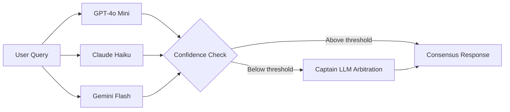
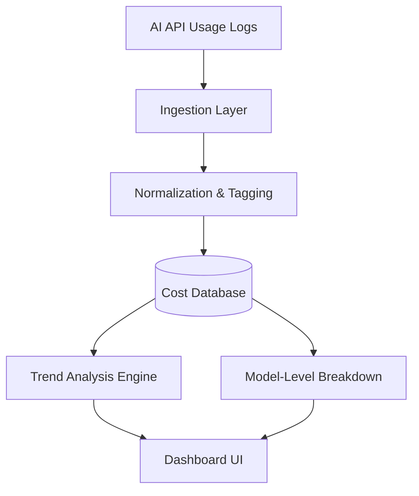

<!-- Custom animated typing header (renders as SVG, dark-theme friendly) -->

 

I enjoy turning advances in AI into products that solve real problems.
My work sits at the intersection of <b>AI Product Management</b>, <b>LLM systems</b>,

## 🚀 Featured Projects

<b>⚖️ LLM Council</b> — Multi-LLM reasoning engine with arbitration

 

A multi-LLM reasoning engine that runs **GPT-4o Mini**, **Claude Haiku**, and **Gemini Flash** in parallel, then escalates disagreements to a **Captain LLM** for arbitration whenever confidence falls below a defined threshold.

**Highlights**
- Parallel multi-model inference
- Confidence-based routing
- Consensus & arbitration architecture
- Built with Next.js + TypeScript

**How it works**

**Links**
- 🌐 [Live Demo](https://llm-council-fvzmmcsil-siddharth-prabhus-projects-cd132588.vercel.app)
- 💻 [Source Code](https://github.com/siddharthprabhu8/LLM_Council)

<!-- Replace this with an actual screen-recording GIF (see setup steps below) -->

 

<b>💰 CostLens</b> — Open-source AI cost intelligence dashboard

 

An open-source AI cost intelligence dashboard that transforms raw AI API usage into actionable cost insights.

**Designed to help developers and startups understand:**
- Where every AI dollar goes
- Cost trends over time
- Model-level usage
- Optimization opportunities

**Architecture**

Currently focused on making AI infrastructure spending transparent and understandable.

<!-- Replace this with an actual screen-recording GIF (see setup steps below) -->

 

<b>🚕 Uber Marketplace Breakdown</b> — Deep product teardown

 

A deep product teardown exploring how Uber's marketplace operates across **India, the UAE, and the UK**.

The analysis covers marketplace dynamics, pricing, incentives, driver supply, rider demand, localization strategies, and opportunities to improve the experience through product thinking.

## 🛠️ Currently Building

- 💰 **CostLens** — Open-source AI cost intelligence platform
- 🧑‍💼 **Arcus** — AI-powered hiring platform
- 🧠 AI product breakdowns and case studies
- ⚡ Open-source AI developer tools

## 🌱 Currently Exploring

- Machine Learning fundamentals
- Feature engineering & model evaluation
- AI Product Management
- LLM architectures & AI systems
- Next.js, TypeScript, and modern full-stack development

## 💻 Tech Stack

## ✍️ Product Philosophy

I believe great AI products are built by combining strong product thinking with rapid experimentation.

Technology alone rarely creates value. The differentiator is designing systems that are reliable, intuitive, and genuinely useful for the people using them.

My goal is to build AI products that make people **faster, smarter, and more effective** — not simply automate existing workflows.

## 📈 Building in Public

<!--START_SECTION:activity-->
<!--END_SECTION:activity-->

## 🤝 Connect

⭐ Thanks for stopping by — feel free to explore the pinned repos above.

